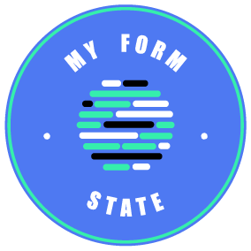

# my-form-state



> react/redux form state management library. One library to rule them all.

[](https://www.npmjs.com/package/my-form-state) [](https://standardjs.com)

This is a React/Redux form state management library with/without hooks.

Form libraries are complex, they don't make a separation between state and UI. You always end up building custom components on top of the library components that at the same time are on top of the HTML elements!!!. This makes it complex, hard to maintain and hard to change. Too many abstractions :(

This library was built for the sole purpose of unifying and simplifying the way we manage the state with React and/or Redux.

If you use Redux or just React, this library is for you! Yes, it is not a typo. You can use this library with one or the other, or both! It doesn't matter since it is implemented with [Ducks](https://github.com/erikras/ducks-modular-redux) under the hood.

It provides a simple hook API that you can initialize in a container component and pass down the form-state to your form.

Last but not least, it integrates with [Yup](https://github.com/jquense/yup)/[Joi](https://github.com/hapijs/joi)/[JsonSchema](https://json-schema.org/) for data validation.

## Documentation

Check the [Documentation](https://docs-my-form-state.netlify.com/). The API is easy and fast to develop!

## Note

The library is fully tested using Jest and fully documented using JsDoc.

## Getting Started

```bash
npm install --save my-form-state
```

### Peer Dependencies

They depend on how you want to use the library:

#### Just React:

```bash
{
    "react",
    "react-dom",
}
```

#### With React-Redux

```bash
{
    "react",
    "react-dom",
    "redux",
    "react-redux",
}
```

## Example with React-Redux

The library will initialize a `my-form-state` entry in your redux state where all the forms data will live. You can check the state at any given time using the redux tools. Any change in the redux state form will trigger an update in the `useMyFormState` hook.

```js
import React from 'react';
import { useMyFormState } from 'my-form-state/react-redux';
import Form from '@Your-form-component';

const MyFormContainer = ({ onSubmit }) => {
  const [formState, { updateField, submitForm, resetForm }] = useMyFormState();

  const onFieldChangeHandler = (field, value) => updateField({ field, value });

  const onSubmitHandler = async () => {
    const result = await submitForm();
    onSubmit(result);
  };

  return <Form formState={formState} onFieldChange={onFieldChangeHandler} onSubmit={submitForm} onReset={resetForm} />;
};

export default MyFormContainer;
```

## Example with only React (No Redux)

The library will keep the state internal to your component. No extra configuration needed.

```js
import React from 'react';
import { useMyFormState } from 'my-form-state/react'; <-- THIS IS THE ONLY DIFFERENCE ;) -->
import Form from '@Your-form-component';

const MyFormContainer = ({ onSubmit }) => {
  const [formState, { updateField, submitForm, resetForm }] = useMyFormState();

  const onFieldChangeHandler = (field, value) => updateField({ field, value });

  const onSubmitHandler = async () => {
    const result = await submitForm();
    onSubmit(result);
  };

  return (
    <Form
      formState={formState}
      onFieldChange={onFieldChangeHandler}
      onSubmit={submitForm}
      onReset={resetForm}
    />
  );
};

export default MyFormContainer;
```

## With form schema.

```js
import React from 'react';
import { formSchema } from 'my-form-state/core/validators/yup';
import { useMyFormState } from 'my-form-state/react';
import * as YUP from 'yup';
import Form from '@Your-form-component';

const YUPSchema = YUP.object().shape({
  alias: YUP.string().required(),
});

const MyFormContainer = ({ onSubmit }) => {
  const [formState, { updateField, submitForm, resetForm }] = useMyFormState({
    initialState: { alias: 'guiyep' },
    formSchema: formSchema(YUPSchema),
  });

  const onFieldChangeHandler = (field, value) => updateField({ field, value });

  const onSubmitHandler = async () => {
    const result = await submitForm();
    onSubmit(result);
  };

  return (
    <Form formState={formState} onFieldChange={onFieldChangeHandler} onSubmit={onSubmitHandler} onReset={resetForm} />
  );
};

export default MyFormContainer;
```

## Storybook

Check [Storybook](https://storybook-my-form-state.netlify.com/) for more examples.

## Another work I have done :)

- react-select-virtualized [](https://www.npmjs.com/package/react-select-virtualized)
